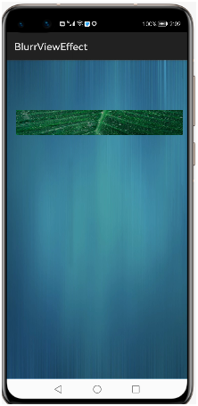
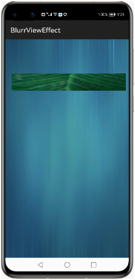
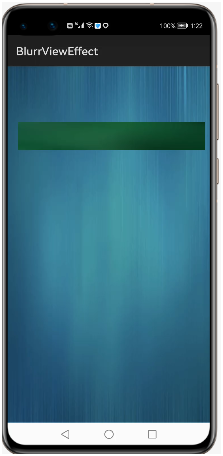

# ViewEffects
[](https://sonarcloud.io/dashboard?id=applibgroup_SpannableTextView)
[](https://github.com/applibgroup/SpannableTextView/actions/workflows/main.yml)
 
## Introduction
 
###### At the beginning the only purpose was to blur all layers below. Now you can do more :
###### 1.Blur background views easily.
###### 2.Create custom filters and apply them to views backgrounds.

## Source
 
###### The code in this repository was inspired from [mirrajabi/view-effects - v1.0](https://github.com/mirrajabi/view-effects). We are very thankful to mirrajabi.

## Screenshot

  
 
 


## Installation

1 .For using vieweffects module in sample app, include the source code and add the below dependencies in entry/build.gradle to generate hap/support.har.

```groovy
dependencies{
    implementation fileTree(dir: 'libs', include: ['*.jar', '*.har'])
    implementation project(path: ':vieweffects')
    testImplementation 'junit:junit:4.13'
}
```
2 .For using vieweffects in separate application using har file, add the har file in the entry/libs folder and add the dependencies in entry/build.gradle file.

```groovy
dependencies{
    implementation fileTree(dir: 'libs', include: ['*.jar', '*.har'])
    implementation project(path: ':vieweffects')
    testImplementation 'junit:junit:4.13'
}
```
​
## Usage

Generate the following style:

With the code below:
```
    xml
    <DependentLayout
        xmlns:ohos="http://schemas.huawei.com/res/ohos"
        ohos:id="$+id:view_root"
        ohos:height="match_parent"
        ohos:width="match_content"
        ohos:background_element="$media:blue">
    
        <DirectionalLayout
            ohos:id="$+id:view_custom"
            ohos:height="50vp"
            ohos:width="match_parent"
            ohos:background_element="$media:green"
            ohos:left_margin="20vp"
            ohos:orientation="vertical"
            ohos:right_margin="10vp"
            ohos:top_margin="100vp"
            >
        </DirectionalLayout>    
    </DependentLayout>  
```
```
    Java
    ViewFilter.getInstance(this).setRenderer(
                new BlurRenderer(300)).applyFilterOnView(
                findComponentById(ResourceTable.Id_view_custom));
  
```
## Support & extension

Currently there is a limitation to set multiple background images in single layout